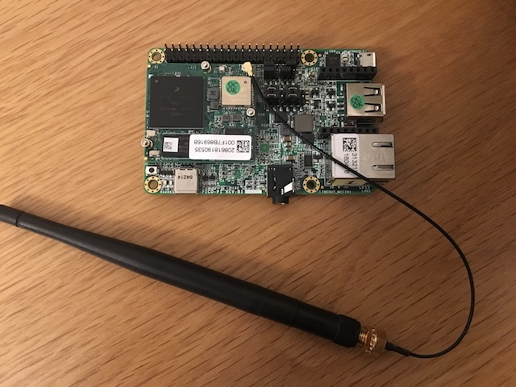
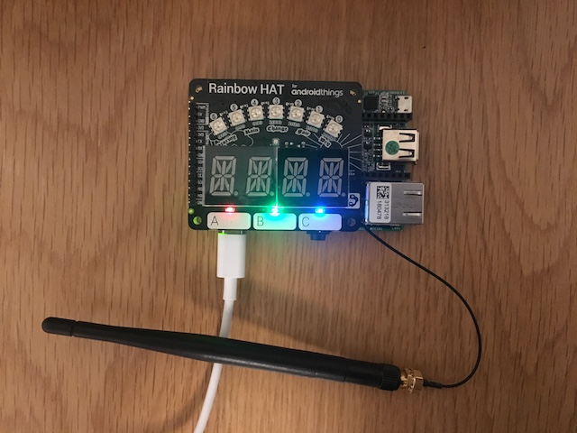
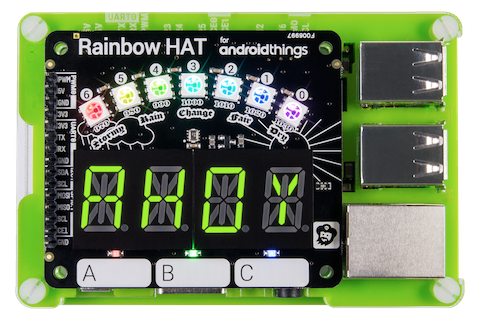
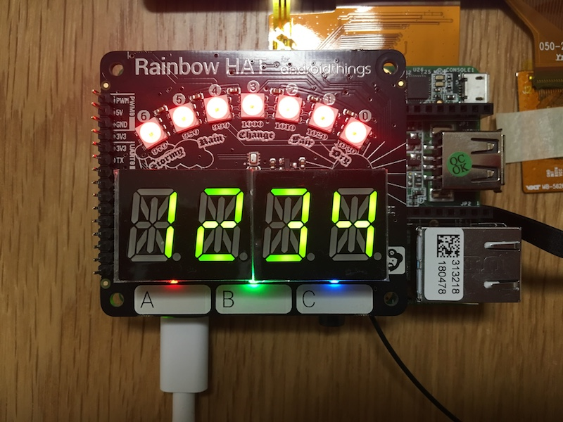
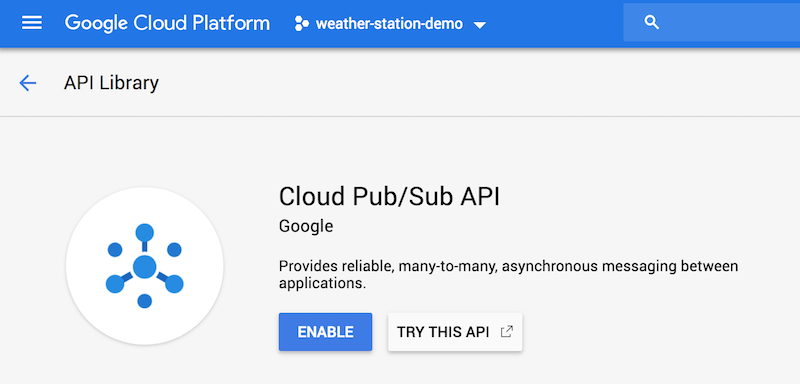
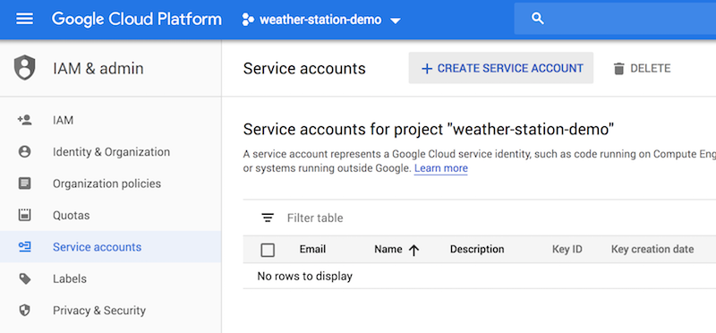
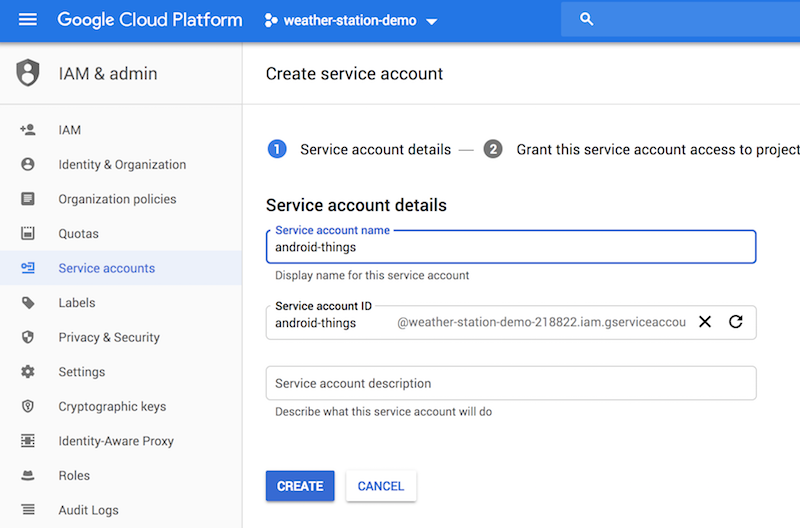

EPF IoT class Hands-on 
======================

This is a fork of Android Things weather station codelab, prepared for EPF IoT course 2018-2019.

# Prerequisite

- A PC or a Mac with latest [Android Studio](https://developer.android.com/studio/) installed
- An [Android Things starter kit](https://androidthings.withgoogle.com/#!/kits/starter-kit) with the latest image installed
- Basic knowledge of Linux/Unix system
- Basic knowledge of Android development
- Basic knowledge of Java or Kotlin

Let's get started! 💪🏻

# Preparation

The board given to each of you is already flashed with the latest version of Android Things. The main board is a NXP Pico i.MX7 Dual development board.

## Set up your Android Things board

First plug the wifi antenna, then the Rainbow HAT onto your Pico board.





### Optional: Multi-touch display

If you want to set up the multi-touch display, follow the instruction of Multi-touch display section [here](https://androidthings.withgoogle.com/#!/kits/starter-kit). Don't hesitate to ask for help. 


## Set up ADB

Make sure you already installed the latest stable release of Android Studio. Go to `menu -> Preferences -> Android SDK` and find your Android SDK location (e.g. `/Users/qian/Library/Android/sdk/`)
- Add SDK's `platform-tools` to your path. An example for MAC user, add following line in your `.bash_profile` or `.bashrc`:

```
export PATH="/Users/qian/Library/Android/sdk/platform-tools:$PATH"
```

This will allow you to use ADB (Android Debug Bridge) easily from a terminal. Once you have adb ready, plug Android Things board and verify if it's properly connected:

```
$ adb devices
List of devices attached
xxxxxx  device
```

Make sure you can access adb shell:
```
$ adb shell
imx7d_pico:/ $ 
```

## Other setups

The board handed to you is already flashed with the latest version of Android Thing and pre-configured with the following wifi:

- SSID: `things`
- Password: `HelloAndroidThings`

If you need do some further setups (flashing board, set up wifi...), download the [Android Things Setup Utility](https://partner.android.com/things/console/#/tools) from the Android Things Console. You will need to sign in to your Google account and accept the licensing agreement and terms of service.

# Get Started

In this hands-on, you're going to build a weather station that reads temperature and pressure data from a BMP280 sensor and displays the latest reading locally on the [Rainbow HAT](https://shop.pimoroni.com/products/rainbow-hat-for-android-things).

## About the hardware

The expansion connector on the development board exposes Peripheral I/O signals for application use. The Rainbow HAT sits on top of the expansion connector, providing a variety of inputs and outputs for developers to interact with.



> This hands-on makes use of the [RainbowHat driver](https://github.com/androidthings/contrib-drivers/tree/master/rainbowhat) to provide access to the individual peripherals, so these signal names are for your information only. Your code will access these peripherals through the RainbowHat class.

## Playground

Before start building the weather station, let's get familiar with the board by playing with some of the component on the Rainbow HAT. Open the playground project inside this repository with Android Studio and go to `MainActivity.java`.

### Add Permission

In order to manipulate peripheral pins, you have to add this permission in `AndroidManifest.xml`:

```xml
<uses-permission android:name="com.google.android.things.permission.USE_PERIPHERAL_IO"/>
```

### Add Rainbow HAT driver 🌈

The [RainbowHat driver](https://github.com/androidthings/contrib-drivers/tree/master/rainbowhat) provides easy access to the peripherals available on the Rainbow Hat for Android Things, add the dependency in the `build.gradle` of your application (path: `playground/app/build.gradle`):

```
dependencies {
    ...
    implementation 'com.google.android.things.contrib:driver-rainbowhat:1.0'
}
```

### Basic GPIO: LED 🚥

LED is controlled by a digital GPIO pin, there are 3 LEDs on the rainbow HAT, their pin names mapping with Rainbow HAT on a Pico board are:

- Red LED: `GPIO2_IO02`
- Green LED: `GPIO2_IO00`
- Blue LED: `GPIO2_IO05`

In order to manipulate them, you can use `PeripheralManager`, try to add this code inside `onCreate()` and launch it on your Android Things:

```java
private Gpio redLed;

@Override
protected void onCreate(Bundle savedInstanceState) {
    super.onCreate(savedInstanceState);
	
	PeripheralManager service = PeripheralManager.getInstance();
	Gpio redLed = service.openGpio(GPIO_RED_LED);
	redLed.setDirection(Gpio.DIRECTION_OUT_INITIALLY_LOW);
	redLed.setValue(true);
}
```

The `setDirection` method sets the GPIO pin's initial value as low, which means the LED is not lit.

When you are done with the GPIO pin, dont forget to close it in `onDestry()` method to free the resource:

```java
@Override
protected void onDestroy() {
    super.onDestroy();
    redLed.close();
}
```

You are probably noticing that IDE is underlining the `openGpio` method, telling you there is unhandled IOException, so don't forget to wrap your code inside a `try catch`.

With the Rainbow HAT driver, the same code can actually be much simpler:

```java
redLed = RainbowHat.openLedRed();
redLed.setValue(true);
redLed.close();
```

#### 💻 Exercise 💻

Light up the red and blue light while keeping the green off. 

Raise hands when you are done 👋🏻

### Basic GPIO: Button 🕹

Now you know how output can be controlled from code, let's check out how to play with the input. One of the input on the rainbow HAT is the button. There are 3 buttons: Button A, B and C.

Following code shows how to detect when the button A is pressed:

```java
// Detect when button 'A' is pressed.
Button button = RainbowHat.openButtonA();
button.setOnButtonEventListener(new Button.OnButtonEventListener() {
    @Override
    public void onButtonEvent(Button button, boolean pressed) {
        Log.d(TAG, "button A pressed:" + pressed);
    }
});

// Close the device when done.
button.close();
```

Every time the button is pressed, the `OnButtonEventListener` will received the event, thus you can carry out actions inside the callback. Read carefully with the log to understand the behavior of the button and how the boolean `pressed` changed.

#### 💻 Exercise 💻

Control the led with your button, for example, when press on the button A, the red LED is lit; when the button is pressed again, the red LED is turned off. Raise hands when you are done 👋🏻

## Weather Station 🌤

The peripherals on the Rainbow HAT used in this codelab are connected to the following signals. These are also listed on the back of the Rainbow HAT:

- [BMP280 Environmental Sensor](https://cdn-shop.adafruit.com/datasheets/BST-BMP280-DS001-11.pdf)
- [HT16K33 Segment Display](https://cdn-shop.adafruit.com/datasheets/ht16K33v110.pdf)
- [APA102 RGB LED Strip](https://cdn-shop.adafruit.com/datasheets/APA102.pdf)

### 1. Open starter project

Now open the `weatherstation-start` project with Android Studio. The starter project contains the following source files:

- `RainbowUtil`: Helper class to compute the Rainbow colors displayed on the Rainbow HAT RGB LED strip. Your code will reference this class to convert sensor readings into the proper display colors.
- `WeatherStationActivity`: Main activity of the application. The code you write in this codelab will be placed here. The app-level build.gradle file includes a dependency for Android Things support library to enable access to the Peripheral I/O API:

```
compileOnly 'com.google.android.things:androidthings:1.0'
```

### 2. Write display data

The Rainbow HAT includes an HT16K33 segment display driver connected over the I2C serial bus and a strip of seven APA102 RGB LEDs connected over the SPI serial bus. You will be accessing these devices using drivers provided for the Rainbow HAT.

#### Add Rainbow HAT driver

Add the rainbow HAT driver as you did for the playground, inside the app-level `build.gradle` file:

```
dependencies {
    ...
    implementation 'com.google.android.things.contrib:driver-rainbowhat:1.0'
}
```

#### Connect the alphanumeric display and LED strip

Open the `WeatherStationActivity` class, and declare new fields for an `AlphanumericDisplay` and `Apa102` LED strip:

```java
import com.google.android.things.contrib.driver.apa102.Apa102;
import com.google.android.things.contrib.driver.ht16k33.AlphanumericDisplay;
import com.google.android.things.contrib.driver.rainbowhat.RainbowHat;

public class WeatherStationActivity extends Activity {
    
    //...

    private AlphanumericDisplay mDisplay;
    private Apa102 mLedstrip;

    @Override
    protected void onCreate(Bundle savedInstanceState) {
        super.onCreate(savedInstanceState);
        Log.d(TAG, "Weather Station Started");
    }
}
```

Open a connection to both peripherals in `onCreate()`using the `RainbowHat` driver. Set the `AlphanumericDisplay` to show the value 1234, and the `Apa102` to display `Color.RED` across all the LEDs in the strip:

```java
@Override
protected void onCreate(Bundle savedInstanceState) {
    super.onCreate(savedInstanceState);
    Log.d(TAG, "Weather Station Started");

    // Initialize 14-segment display
    try {
        mDisplay = RainbowHat.openDisplay();
        mDisplay.setEnabled(true);
        mDisplay.display("1234");
        Log.d(TAG, "Initialized I2C Display");
    } catch (IOException e) {
        throw new RuntimeException("Error initializing display", e);
    }

    // Initialize LED strip
    try {
        mLedstrip = RainbowHat.openLedStrip();
        mLedstrip.setBrightness(LEDSTRIP_BRIGHTNESS);
        int[] colors = new int[7];
        Arrays.fill(colors, Color.RED);
        mLedstrip.write(colors);
        // Because of a known APA102 issue, write the initial value twice.
        mLedstrip.write(colors);

        Log.d(TAG, "Initialized SPI LED strip");
    } catch (IOException e) {
        throw new RuntimeException("Error initializing LED strip", e);
    }
}
```

#### Clean up your resources

Add the following code to `onDestroy()` to turn off both output devices and close the connections once they are no longer needed:

```java
@Override
protected void onDestroy() {
    super.onDestroy();

    if (mDisplay != null) {
        try {
            mDisplay.clear();
            mDisplay.setEnabled(false);
            mDisplay.close();
        } catch (IOException e) {
            Log.e(TAG, "Error closing display", e);
        } finally {
            mDisplay = null;
        }
    }

    if (mLedstrip != null) {
        try {
            mLedstrip.setBrightness(0);
            mLedstrip.write(new int[7]);
            mLedstrip.close();
        } catch (IOException e) {
            Log.e(TAG, "Error closing LED strip", e);
        } finally {
            mLedstrip = null;
        }
    }
}
```

#### Verify the new behavior

Deploy the app to the device by selecting **Run → Run 'app'** from the menu, or click the **Run** icon in the toolbar. Verify that the display shows "1234" and all the LEDs on the Rainbow HAT are glowing red.



Raise hands when you are done 👋🏻

### 3. Read sensor data

The Rainbow HAT includes a BMP280 temperature and pressure sensor that is connected over the I2C serial bus. This driver handles the low-level I2C communication and binds the new sensor to the Android framework as a user-space driver. Once the driver is registered, your code will retrieve the sensor data using the standard SensorManager system service.

#### Add the required permission

Add the `MANAGE_SENSOR_DRIVERS` permission to your `AndroidManifest.xml`. This permission is required to register any new sensor as a user-space driver.

```xml
<uses-permission android:name="com.google.android.things.permission.MANAGE_SENSOR_DRIVERS" />
```

#### Connect the temperature sensor

Declare a new `Bmx280SensorDriver` and initialize it in `onCreate()`. Register the user-space drivers for each individual sensor on the BMP280 with the sensor framework:

```java
import com.google.android.things.contrib.driver.bmx280.Bmx280SensorDriver;

public class WeatherStationActivity extends Activity {
    ...

    private Bmx280SensorDriver mEnvironmentalSensorDriver;

    @Override
    protected void onCreate(Bundle savedInstanceState) {
        super.onCreate(savedInstanceState);
        Log.d(TAG, "Weather Station Started");

        // Initialize temperature/pressure sensors
        try {
            mEnvironmentalSensorDriver = RainbowHat.createSensorDriver();
            // Register the drivers with the framework
            mEnvironmentalSensorDriver.registerTemperatureSensor();
            mEnvironmentalSensorDriver.registerPressureSensor();

            Log.d(TAG, "Initialized I2C BMP280");
        } catch (IOException e) {
            throw new RuntimeException("Error initializing BMP280", e);
        }

        //...
    }
}
```

#### Listen for sensor events

Obtain a reference to the `SensorManager` system service in `onCreate()`:

```java
private SensorManager mSensorManager;

@Override
protected void onCreate(Bundle savedInstanceState) {
    super.onCreate(savedInstanceState);
    Log.d(TAG, "Weather Station Started");

    mSensorManager = getSystemService(SensorManager.class);

    ...
}
```

Implement the `updateTemperatureDisplay()` method to write the temperature sensor value out to the segment display:

```java
private void updateTemperatureDisplay(float temperature) {
    if (mDisplay != null) {
        try {
            mDisplay.display(temperature);
        } catch (IOException e) {
            Log.e(TAG, "Error updating display", e);
        }
    }
}
```

Implement the `updateBarometerDisplay()` method to update the RGB LED strip based on the pressure sensor value:

> Use the `RainbowUtil.getWeatherStripColors()` helper to convert the pressure value into a color array for the Apa102 driver.

```java
private void updateBarometerDisplay(float pressure) {
    if (mLedstrip != null) {
        try {
            int[] colors = RainbowUtil.getWeatherStripColors(pressure);
            mLedstrip.write(colors);
        } catch (IOException e) {
            Log.e(TAG, "Error updating ledstrip", e);
        }
    }
}
```

Declare a new `SensorEventListener` to receive events generated for new temperature and pressure values and call the two update methods you just implemented:

```java
// Callback when SensorManager delivers new data.
private SensorEventListener mSensorEventListener = new SensorEventListener() {
    @Override
    public void onSensorChanged(SensorEvent event) {
        final float value = event.values[0];

        if (event.sensor.getType() == Sensor.TYPE_AMBIENT_TEMPERATURE) {
            updateTemperatureDisplay(value);
        }
        if (event.sensor.getType() == Sensor.TYPE_PRESSURE) {
            updateBarometerDisplay(value);
        }
    }

    @Override
    public void onAccuracyChanged(Sensor sensor, int accuracy) {
        Log.d(TAG, "accuracy changed: " + accuracy);
    }
};

```

Register the listener for each sensor on the BMP280. User-space drivers register the sensors with the framework as dynamic sensors, so you can access them from the `getDynamicSensorList()` method:

```java
@Override
protected void onStart() {
    super.onStart();

    // Register the BMP280 temperature sensor
    Sensor temperature = mSensorManager
            .getDynamicSensorList(Sensor.TYPE_AMBIENT_TEMPERATURE).get(0);
    mSensorManager.registerListener(mSensorEventListener, temperature,
            SensorManager.SENSOR_DELAY_NORMAL);
    // Register the BMP280 pressure sensor
    Sensor pressure = mSensorManager
            .getDynamicSensorList(Sensor.TYPE_PRESSURE).get(0);
    mSensorManager.registerListener(mSensorEventListener, pressure,
            SensorManager.SENSOR_DELAY_NORMAL);
}

@Override
protected void onStop() {
    super.onStop();

    mSensorManager.unregisterListener(mSensorEventListener);
}
```

#### Clean up your resources

Add the following code to `onDestroy()` to close the driver connection:

```java
@Override
protected void onDestroy() {
    super.onDestroy();

    if (mEnvironmentalSensorDriver != null) {
        try {
            mEnvironmentalSensorDriver.close();
        } catch (IOException e) {
            Log.e(TAG, "Error closing sensors", e);
        } finally {
            mEnvironmentalSensorDriver = null;
        }
    }

    // ...
}
```

#### Verify the new behavior

Deploy the app to the device by selecting **Run → Run 'app'** from the menu, or click the **Run** icon in the toolbar. 

Verify that the Rainbow HAT display now shows the current temperature in ℃ and the LEDs show a rainbow gauge that corresponds to the pressure reading.


Raise hands when you are done 👋🏻

#### (optional) add some graphic display


### 4. Publish sensor data to Google Cloud Pub/Sub ☁

In this step, we are going to publish the sensor data to the [Google Cloud Pub/Sub](https://cloud.google.com/pubsub/docs/). Cloud Pub/Sub is a fully-managed real-time messaging service that allows you to send and receive messages between independent applications.

A publisher application creates and sends messages to a topic. Subscriber applications create a subscription to a topic to receive messages from it. Communication can be one-to-many (fan-out), many-to-one (fan-in), and many-to-many.


Make sure you have a valid Google Account before starting this step.

#### Add internet permission

Until this point, your Android Things hasn't communicated with the internet yet. Now added the internet permission in your `AndroidManifest.xml`:

```xml
<uses-permission android:name="android.permission.INTERNET" />
```

Since the Pub/Sub client will also need to know the network state, add this permission too:

```xml
<uses-permission android:name="android.permission.ACCESS_NETWORK_STATE" />
```

#### Configure your project

- Create a project in the [Google Cloud Platform console](https://console.cloud.google.com/).
- Under **API & Service dashboard**, enable the following APIs: Cloud Pub/Sub.



- Under **IAM & Admin**, create a new Service Account, provision a new private key with JSON format and save the generated credentials with the filename `credentials.json`.





- Under **Pub/Sub**: create a new topic (e.g. `weather`) and in the **Permissions** add the service account created in the previous step with the role *Pub/Sub Publisher*.
- Under **Pub/Sub**: create a new **Pull subscription** on your new topic.
- Add the `credentials.json` you downloaded in the previous steps to `app/src/main/res/raw/` folder.
- In `app/build.gradle`, replace the `buildConfigField` values with values from your project setup.

```
buildConfigField "String", "PROJECT_ID", '"weather-station-demo-xxxx"'
buildConfigField "String", "PUBSUB_TOPIC", '"weather"'
```

#### Start the publisher

```java
private PubsubPublisher mPubsubPublisher;

@Override
protected void onCreate(Bundle savedInstanceState) {
    super.onCreate(savedInstanceState);
    Log.d(TAG, "Started Weather Station");
	
	...
	
	// start Cloud PubSub Publisher if cloud credentials are present.
    int credentialId = getResources().getIdentifier("credentials", "raw", getPackageName());
    if (credentialId != 0) {
        try {
            mPubsubPublisher = new PubsubPublisher(this, "weatherstation",
                BuildConfig.PROJECT_ID, BuildConfig.PUBSUB_TOPIC, credentialId);
            mPubsubPublisher.start();
        } catch (IOException e) {
            Log.e(TAG, "error creating pubsub publisher", e);
        }
    }
}
```

#### Register listeners

```java
@Override
protected void onStart() {
    super.onStart();
	
	// ...

    mSensorManager.registerListener(mPubsubPublisher.getTemperatureListener(), temperature,
        SensorManager.SENSOR_DELAY_NORMAL);
    mSensorManager.registerListener(mPubsubPublisher.getPressureListener(), pressure,
        SensorManager.SENSOR_DELAY_NORMAL);
}
```

#### Clean up publisher 

```java
@Override
protected void onDestroy() {
    super.onDestroy();
	if (mPubsubPublisher != null) {
        mSensorManager.unregisterListener(mPubsubPublisher.getTemperatureListener());
        mSensorManager.unregisterListener(mPubsubPublisher.getPressureListener());
        mPubsubPublisher.close();
        mPubsubPublisher = null;
    }
}
```

#### Verify data publishing 👀

The default publishing interval is 1 minutes, you can tweak it in class `PubsubPublisher` to accelerate the test:

```java
private static final long PUBLISH_INTERVAL_MS = TimeUnit.MINUTES.toMillis(1);
```

Now launch again your project, you should be able to see in your Logcat if the publish is success. Then you can check if your data is ingested in Google Cloud Pub/Sub by using `gcloud` client, running the following command:
```
gcloud --project <CLOUD_PROJECT_ID> beta pubsub subscriptions pull <PULL_SUBSCRIBTION_NAME>
```

> TO install `glcoud` client: https://cloud.google.com/sdk/gcloud/

Raise hands when you are done 👋🏻

## One Last Things

Please uninstall your application from the Android Things board you use by running this adb command:

```
$ adb uninstall com.example.androidthings.weatherstation
```

Hope you all enjoyed this hands-on and learned something about IoT & Android Things 🤓

# Reference

- https://codelabs.developers.google.com/codelabs/androidthings-weatherstation
- https://github.com/androidthings/weatherstation